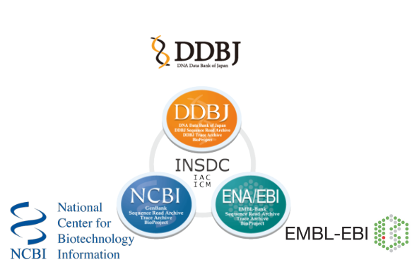
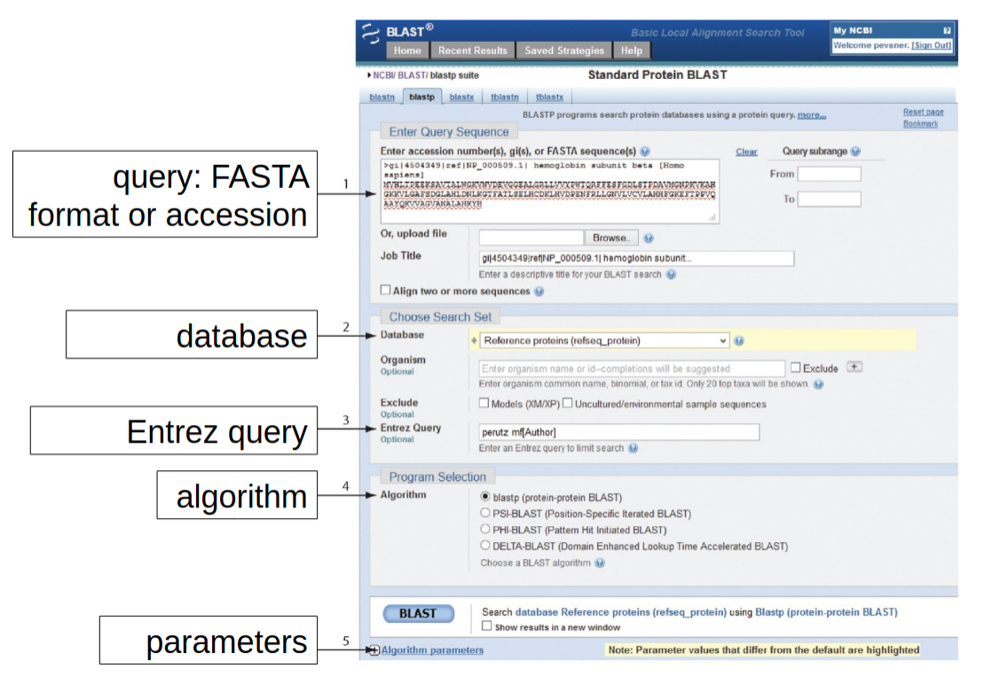
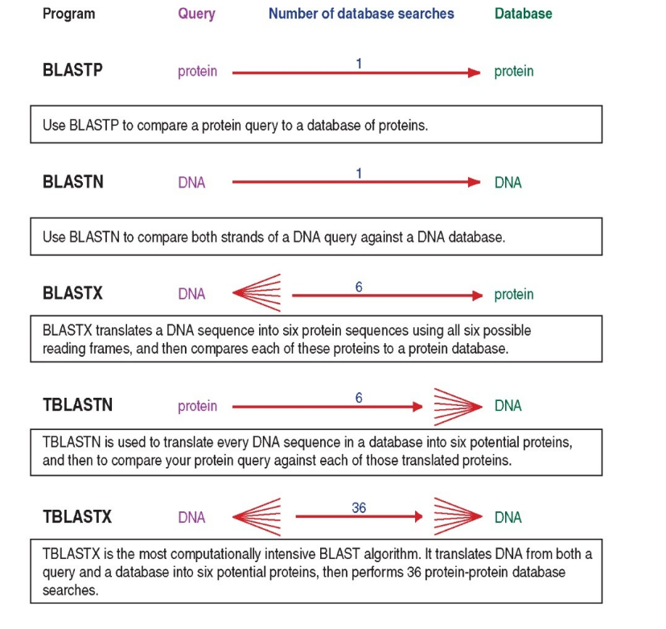
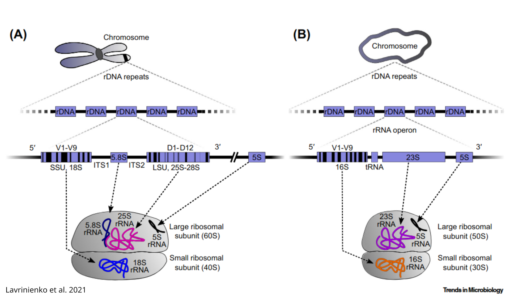
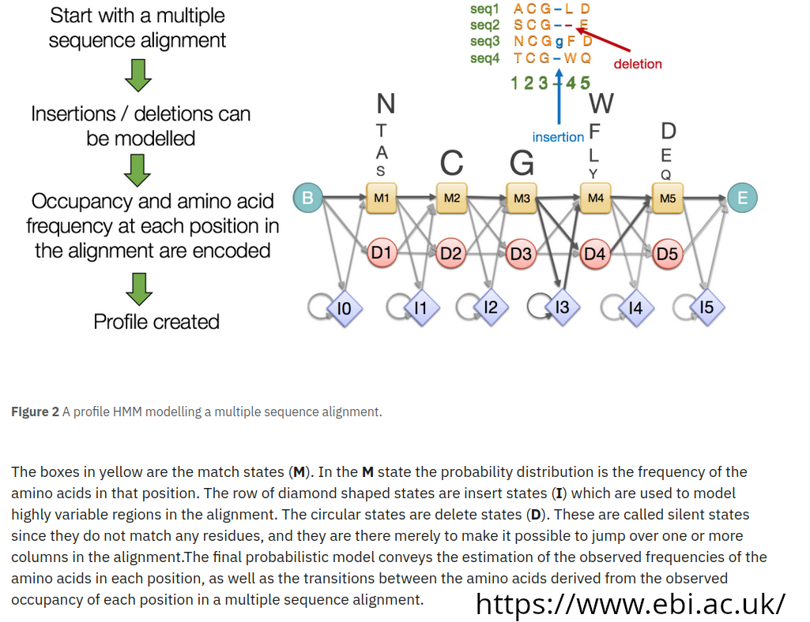

# Sequence Databases and similarity Search
This repository contains the materials for the "Databases in ecology and comparative genomics course": day 1.
It deals with the primary Nucleotide (and protein) databases (e.g. NCBI Genbank) and the way to interrogate them!

### Software required (on HPC)
- BLAST 2.16.0
- NCBI datasets
- HMMER3.4
- Trimal
- Iqtree2
- mafft
### Software required (locally)
- a fasta file reader (MEGA, Aliview, Jalview, Bioedit ...)
- Terminal (Win, Linux and Mac) to ssh into the HPC and (optionally) GUI file client (e.g. Filezilla)
- (optionally) Figtree, iTOL works from browser 

### BEFORE WE START
Login to your account on the HPC and start an interactive session (as we won't run long analyses that require to submit a job to the cluster queue):
```bash
ssh username@l2.gsc1.uni-graz.at

srun --mem=8G --ntasks=4 --cpus-per-task=1 --time=10:00:00 --pty bash
```

download this repository:
```bash
git clone https://github.com/claudioametrano/name-of-the-repository.git
```

Rename the folder containing the results, so you won't overwrite it running the analyses of this tutorial, and it will be available if needed:
```bash
mv results results_backup  
```

We will work on the HPC cluster (High Performace Computing) using Docker containers which have the specific software we need, then every command will need this before the actual command that launch that analysis
```bash
$ docker run --rm -u $(id -u):$(id -g) -v $(pwd):/in -w /in path/to/the/container/name-of-the-container command-to-launch
```
**docker run** ->	Starts a new Docker container.
**--rm** ->	Automatically removes the container once it finishes running. 
**-u \$(id -u):$(id -g)** ->	Runs the container as the current user (user ID and group ID), so the output files are not owned by root.
**-v $(pwd):/in** ->	Mounts the current directory (pwd) from your host into the container at /in. This makes your local files accessible to the container.
**-w /in** ->	Sets the working directory inside the container to /in (which maps to your current directory).

It is also possible to install software via Conda, in this case command of this tutorial can be launched as they are written, but you will need to install Anaconda/Miniconda and the following software:
```bash
conda install conda-forge::mamba
mamba install bioconda::blast=2.16.0
mamba install conda-forge::ncbi-datasets-cli=18.2.0
mamba install bioconda::hmmer=3.4
mamba install bioconda::trimal=1.5.0
mamba install bioconda::iqtree=2.4.0
mamba install bioconda::mafft=7.525

```

### 1- Nucleotide Sequence Databases
Sequence databases are scientifically invaluable, they serve as comprehensive repositories for DNA (and proteins) submitted by researchers. They provide centralized, standardized, and easily searchable collections of genetic data (from genes to entire genomes), enabling organism identification (DNA barcoding and meta-barcoding), evolutionary studies, comparative and functional genomics. As important as the database, is the way we query them to obtain results suitable for our analyses.



Let's have a look at the available resources! 
[National Center for Biotechnology Information: NCBI](https://www.ncbi.nlm.nih.gov/)
**In the main page search for an organism you would like to know more about:
What are the different databases?**

#### **TASK 1**
> Let's create now some queries in the **nucleotide** database (click on "advanced"):
>
 Progressively refine your query with the following steps:
> - Create a simple query that search for all the DNA sequences belonging to **truffles**
> - Only for sequence of **ribosomal RNA**
> - Limit the length range to exclude sequences much longer than rRNA
> - Exclude **environmental** and **uncultured** sequences
> - Visualize one sequence in GenBank format, and in fasta
> - Download all of them as a fasta file and rename it to "tuber_rDNA.fas" (it will come handy later)
 > **Questions:**
 >- What is the number of sequences retrieved for each step with the query becoming more stringent?
> - What are the parameter that most/least impacted the number of sequences?
 >- Are these sequences representing the same locus/i? How would you assess this?
> Why they vary so much in length? What sequencing technology have produced
> these sequences?
______________________________________________________________________

### 2- Sequence Alignment 
All nice and useful but... most of the time, we want to interrogate these database with a query that is a sequence itself! Then, we need  **alignment algorithms** that aligns our query sequence with those in the database.
One widely used example is **[Basic Local Alignment Search Tool: BLAST](https://blast.ncbi.nlm.nih.gov/Blast.cgi)**
It has the enormous advantage to be developed by NBCI itself and it is integrated in its web-services. Let's take a look at what it can do!
 

credit: [allan.haldane@temple.edu](mailto:allan.haldane@temple.edu)
### Bit score and E-value
Bit Score:	Quality of alignment, higher score = better alignment;	Normalized measure of similarity            
E-Value: measures the expected number of “random” sequences with
a score S or better in a random sequence database of equal size.
Lower E-value = less likely the hit was a false-positive

### 2a- Use of BLAST+ suite via web browser
#### **TASK 2**
>- Open the blast_me.fasta file and look what kind of sequence it is (DNA or AA), then select the most suitable BLAST service
>- Load the /data/blast_me.fasta file (or copy/paste the content)
>- Start the BLAST alignment with everything left at default
>- Check results, what is it?
>-  Now try to find it by BLAST in the following species: mouse, rat, chimpanzee, humans, chicken, zebrafish, mosquito, fruit fly, nematode *Caenorhabditis elegans* and baker's yeast. Download a fasta for each.

#### **Optional**: Build a phylogenetic tree with this tiny dataset
>- Put everything in a multi-fasta file 
>- Align using mafft (or anything other similar MSA tool)
>- Revise your alignment by eye before and after deleting not well aligned columns (optionally use Trimal)
>- Use iqtree2 to infer the Maximum Likelihood tree
>-  Visualize you tree with iTOL.  [iTOL:iteractiveTreeOfLife](https://itol.embl.de/itol.cgi). You probably already have a rough idea on how related are these organism, but in case you do not iTOL has a nice Tree of Life welcoming you on their website, compare it with the one you got!


### 2b- Use of BLAST+ Command Line Interface (CLI) 
manual [here](https://www.ncbi.nlm.nih.gov/books/NBK279690/)

Why should I learn command line BLAST when BLAST via browser is so convenient?
- BLAST on custom database
- Automation: run on server/cluster, part of a bioinformatic pipeline
- Speed and limit of online BLAST (e.g. number of max sequences per sumbmission)

We will learn how to use the command line blast tool, also known as BLAST+. We will use it to:
- blast search NCBI databases
- build our own blast database
- retrieve information from blast hits

#### Local BLAST

Show available pre-packaged databases available on NCBI servers by the helper script
```bash
update_blastdb.pl --showall
```

To download a db from NCBI: 
```bash
update_blastdb.pl <database_name>
```
Download some compact and relevant databases for some common barcode markers: **SSU_eukaryote_rRNA, LSU_prokaryote_rRNA, LSU_eukaryote_rRNA,  ITS_RefSeq_Fungi, ITS_eukaryote, 28S_fungal, 18S_fungal,  16S_ribosomal_RNA **


Check NCBI BLAST webpage to understand what tool is suitable for your question
Example of protein-protein BLAST (blastp) query example:
```bash
blastp -query query.fasta -db path/to/db_name -out blastout_query_vs_db_name.txt
```

#### **TASK 3**
> BLAST using the appropriate algorithm the unknown sequence contained in **data/sequence.fasta** against each of the BLAST databases in /data/NCBI_BLAST_databases:
> 
> **Questions:**
> - Which kind of sequence is it? How long is it?
> - What is the appropriate blast command?
> - Why you are not getting meaningful results? How can you try solve it? (hint: relax BLAST)
> - What locus/i is it? How can you visualize this? (hint: do you have "by chance", among the file we produced, one that can help?) 
> - To what organism does the sequence belongs?... Can you tell without any doubt?



#### Let's find out if we can further improve what you got! 
As some BLAST databases are huge (hundreds of Gb) you can BLAST remotely (exactly as you would do on NCBI website using a browser), let's try the default BLASTn using the complete nucleotide Genbank collection 
```bash
blastn -remote -query ./data/sequence.fasta -db nt -out ./results/task3/blastout_sequences_vs_nt.txt
```

How the results differ from what you got so far? Why? 
If you check the databases you used locally, searching for the *Tuber* species from you sequence you will find out... 
```bash
blastdbcmd -db ./data/ncbi_db/ITS_eukaryote_sequences  -entry all | grep "Tuber" | grep "species_name"
```
REMEMBER: your result are dependent both on the method you use and the reference database you have!


#### Bring Your Own Database (BYO~~B~~D)
Building you custom database can be useful in several occasions, in general, every time the search you need to perform using BLAST is not contained in one of the default NCBI databases 

Let's create a BLAST database using as input the genome assembly of *Tuber melanosporum* downloaded from NCBI Genome/dataset under accession **GCA_000151645.1** , but it can also be a genome you just assembled, and you want to know more about

from command line (works as well from the NCBI webpage under genome/dataset)
```bash
datasets download genome accession GCA_000151645.1
```

unzip and build  the database
```bash
makeblastdb -in ./data/GCA_000151645.1.fna \
-dbtype nucl \
-out ./results/GCA_000151645.1_assembly_db 
```

now try to query the newly created database with ./data/sequence.fasta, what do you expect?
```bash
blastn -query ./data/sequence.fasta -db ./results/GCA_000151645.1_assembly_db -out ./results/blastout_sequence_vs_GCA_000151645.1.txt
```
What if you try on another truffle species genome?

### Extract BLAST results from the database

#### A more efficient way to store (and re-use in bioinformatic pipelines) your blast results, and extract aligned sequences 

```bash

blastn -query ./data/sequence.fasta -db ./results/GCA_000151645.1_assembly_db -out ./results/blastout_sequence_vs_GCA_000151645.1_tabfmt.txt  -reward 2 -penalty -3 -gapopen 5 -gapextend 2 -word_size 11 \
-outfmt "6 qseqid sseqid qstart qend sstart send sstrand evalue bitscore pident qcovs sseq"
``` 
-outfmt 6 has its own default fields, but you can customize it, as we just did listing the information we want in the output file (query sequecne id, subject sequecne id, etc.)

redirect the hit in a fasta file
```bash
awk -F'\t' '!seen[$1]++ {print ">" $2 "\n" $NF}' ./results/blastout_sequence_vs_GCA_000151645.1_tabfmt.txt  > ./results/sequence_vs_GCA_000151645.1_first_hit.fasta

```
!seen[$1]++ only keeps one  result per query name ("$1" is the first field) : "Who_am_i_?" in this case

### 3- The right method for every occasion: other commonly used alignment/mapping tools
 BLAST is not the only tool available, some examples of widely used alignment/mapping tools are summarized below. Alignment/mapping, and in general search by sequences similarity is one of the most frequent activity in bioinformatics, so literally a plethora of algorithms exist and are developed.

| Use-case                                                                | Tool                       | main feature                                                               |
| ----------------------------------------------------------------------- | -------------------------- | -------------------------------------------------------------------------- |
| **Rapid protein and nucleotide search** (large databases, metagenomics) | **DIAMOND**;<br>**MMseq2** | faster than BLAST with similar recall                                      |
| **Amplicon clustering/search**, small-to-medium nucleotide search       | **VSEARCH**; **USEARCH**   | faster than BLAST with similar recall<br>                                  |
| **Short-read DNA mapping** (Illumina 50–300 bp)                         | **BWA**; <br>**Bowtie2**   | fast mapping of millions of reads on reference sequence, output in SAM/BAM |
| **Long-read / assembly alignment** (ONT, PacBio, ≥ 1 kb reads)          | **Minimap2**               | mix of speed, accuracy, and splice awareness                               |
| **Remote homology search** (detecting distant protein families/motifs)  | **HMMER3**                 | sensitivity for weakly conserved domains                                   |
| Spliced transcript / protein to genome alignment                        | **EXONERATE**              | Good at finding intron/exon boundaries                                     |

### 3a HMMER
To search sequence databases for homologs of protein sequence and to build protein (and nucleotide) alignment:
- It is based on probabilistic models known as profile hidden Markov models (profile HMMs) --> it can use a profile based on a multiple-sequence alignment (MSA) to captures which positions are conserved or variable across a gene. A profile turns those position-specific patterns into quantitative scores.
- A profile-HMM can model both insertions and deletions, it copes better than a single sequence with "gappy" sequence evolution. WHAT IS HIDDEN, THEN?: the state path  that generated the sequence we observe.
- It need a trusted MSA (as less biase as possible toward specific taxa) to build an effective profile that can obtain trustable homologous sequences


#### Example of users of HMMER profiles:
- [BUSCO](https://busco-data.ezlab.org/v5/data/) (BASED on  [OrthoDB](https://www.orthodb.org/  ) gene sets) 
- [pfam](https://www.ebi.ac.uk/interpro/) (now hosted by InterPro)
- you! :)

#### open an HMM profile and check yourself (from BUSCOs OrthoDB genes sets)
```bash 
tar -xvf ./data/ascomycota_odb12.2025-04-11.tar.gz
```
 You may think about it as block profile with simple position-specific residue frequencies (no gaps; from AUGUSTUS)
```bash
less ./data/ascomycota_odb12.2025-04-11/ascomycota_odb12/prfl/555at4890.prfl
```
... but it is unfortunately more complex than this...
full profile-HMM (Match scores, Insert scores, 7 states possible transitions)
```bash
less ./data/ascomycota_odb12.2025-04-11/ascomycota_odb12/hmms/555at4890.hmm
```
#### Building a profile:
select amino-acid sequences from a gene of interest(in /data  you can find  168997at4890_tRNA-splicing_endonuclease_subunit.fasta) and align with high accuracy setting:
```bash
mafft ./data/168997at4890_tRNA-splicing_endonuclease_subunit.fasta --localpair --reorder --maxiterate 1000 --thread 4 --out 
```
Build the profile
```bash
hmmbuild --cpu 4 --amino ./results/168997at4890_tRNA-splicing_endonuclease_subunit_mafft.hmm ./results/168997at4890_tRNA-splicing_endonuclease_subunit_mafft.fasta

```
Search for homologous sequences in the proteome using the profile.

We run it on the proteome because hmm profiles only work within the same alphabet (no method like tblastn) -> if you want to search a nucleotide sequence (e.g. assemblies, transcriptome) you need a nucleotide hmm profile  
```bash
hmmsearch --cpu 4 -E  1e-5 --pfamtblout ./results/hammerout-168997_vs_Tmel.txt ./results/168997at4890_tRNA-splicing_endonuclease_subunit_mafft.hmm ./data/GCA_000151645.1_ASM15164v1_Tmel_protein.faa 

```

Try blastp for comparison
```bash
makeblastdb -in ./data/GCA_000151645.1_ASM15164v1_Tmel_protein.faa -dbtype prot -out ./results/GCA_000151645.1_protein_db 

blastp -num_threads 4 -evalue 1e-5 -query ./data/168997at4890_tRNA-splicing_endonuclease_subunit.fasta -db ./results/GCA_000151645.1_protein_db -out ./results/blastout_168997at4890_protein_vs_GCA_000151645.1_protein_db.txt
```


### FINAL TASKS
BUILD A REPORT CONTAINING EVERY STEP YOU TOOK, REPORTING THE COMMANDS USED AND THEIR OUTPUT (meaningful examples are enough if the output is big!): 
#### **FINAL TASK A ** 
>
> **Try to find out if the basidiomycetes fungus *Tremella fuciformis*  ([wiki page](https://en.wikipedia.org/wiki/Tremella_fuciformis)) has the genetic potential of doing meiosis**
> 
> **Hints:**
> - Look for the so called meiosis genes in eukaryotes. For example in [Ramesh et al., 2005](https://www.cell.com/current-biology/fulltext/S0960-9822(05)00028-X?large_figure=true) or [Schurko & Logsdon, 2008](https://onlinelibrary.wiley.com/doi/abs/10.1002/bies.20764)
> - Query (NCBI) for the genes in close organims.
> - Search for the genome assembly of *T. fuciformis* .
> - Set up suitable BLAST searches using what you learnt so far
> - for multiple repeated commands, launched over many files is convenient to set up a for loop (here used to unzip multiple .tar.gz files):
```bash
for i in ./data/NCBI_BLAST_databases/*.gz ; do tar -xvzf $i -C ./data/NCBI_BLAST_databases; done 
```


> **Questions:**
> 1) Did you find the meiosis genes using nucleotide sequences as query? If yes/no, why? How did you customize the search?
> 2) What property of the DNA codon system can you exploit in search of remote homologies?
> 3) Are these gene in single copy? 
> 4) What other approach would work? Does directly involve  you performing an alignment?
> 5) What you found looking at the genomic sequence makes sense biologically? (hint: do you know the biology/ecology of the organism?)


####  **FINAL TASK B **
>
>Starting from the same gene set you built in TASK A Use HMMER3 to mine for the same meiosis genes in the gneome assembly of *T.  fuciformis*

> **Questions**
> 1) What are the advantages/disadvantages of this approach? (hint: are nucleotide as effective as aminoacid? yes/no Why?)
> 2) Could you use HMMER with protein profiles for those genes? Why? If no, what is missing? What analysis would need to be performed on the assembly to use protein hmm profile?
> 3) Compare the results of the two approaches


 
