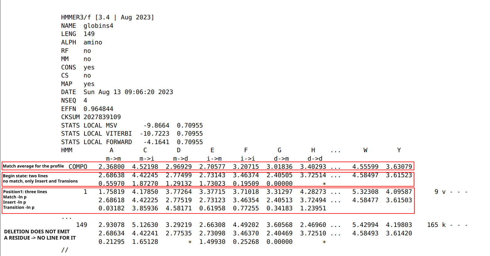

# Sequence databases and similarity search
This repository contains the materials for the "Databases in ecology and comparative genomics course": day 1.
It deals with the primary Nucleotide (and protein) databases and the way to interrogate them!

Github URL: https://github.com/claudioametrano/sequence_databases_similarity_search

### Software required (on HPC)
- BLAST 2.16.0
- NCBI datasets
- HMMER3.4
- Trimal
- Iqtree2
- mafft
### Software required (locally)
- A fasta file reader (Aliview, MEGA, Jalview, Bioedit ...)
- Terminal (Linux and Mac), Mobaxterm (Win), to ssh into the HPC and  GUI file client (e.g. Filezilla, Mobaxterm)
- iTOL (works from browser) 

### BEFORE WE START
Login to your account on the HPC and start an interactive session (as we won't run long analyses that require to submit a job to the cluster queue):
```bash
ssh username@l2.gsc1.uni-graz.at

srun --mem=8G --ntasks=4 --cpus-per-task=1 --time=10:00:00 --pty bash
```

download this repository:
```bash
git clone https://github.com/claudioametrano/sequence_databases_similarity_search
```

Rename the folder containing the results, so you won't overwrite it running the analyses of this tutorial, and it will be available if needed:
```bash
cd sequence_databases_similarity_search
mv results results_backup 
mkdir results
```

We will work on the HPC cluster (High Performance Computing) using Singularity and containers which have the specific software we need (often from [Biocontainers.pro](https://biocontainers.pro/); [Biocontainers paper](https://academic.oup.com/bioinformatics/article/33/16/2580/3096437))

You can either run commands interactively with the container  staying open (`singularity shell`)
```bash
$ singularity pull https://container_address/container_name

$ singularity shell container_name # Start the shell  showing  Sungularity> as long as you stay in the container
 
$ commands you want to run 

$ exit # to exit the container
```

... or just executing a single command (`singularity exec`), useful if you need to submit something running for longer
```bash
$ singularity exec  container_name command_to_run
```

It is also possible to install software via Conda, in this case the commands can be run without `singularity run` or `singularity exec`, but you will need to install Anaconda/Miniconda and the following software:
```bash
conda install conda-forge::mamba
mamba install bioconda::blast=2.16.0
mamba install conda-forge::ncbi-datasets-cli=18.2.0
mamba install bioconda::hmmer=3.4
mamba install bioconda::trimal=1.5.0
mamba install bioconda::iqtree=2.4.0
mamba install bioconda::mafft=7.525

```

### 1- Nucleotide Sequence Databases
Sequence databases are scientifically invaluable, they serve as comprehensive repositories for DNA (and proteins) submitted by researchers. They provide centralized, standardized, and easily searchable collections of genetic data (from genes to entire genomes), enabling organism identification (DNA barcoding and meta-barcoding), evolutionary studies, comparative and functional genomics. As important as the database, is the way we query them to obtain results suitable for our analyses.


Let's have a look at the available resources! 
[National Center for Biotechnology Information: NCBI](https://www.ncbi.nlm.nih.gov/)

**In the main page search for an organism you would like to know more about:
What are the different databases?**

#### **TASK 1**
> Let's now create some queries in the **nucleotide** database (click search then "advanced"):
>
 Progressively refine your query with the following steps:
> - Create a simple query that search for all the DNA sequences belonging to **truffles**
> - Only for sequence of **ribosomal RNA**
> - Limit the length range to exclude sequences much longer than rRNA
> - Exclude **environmental** sequences
> - Visualize one sequence in GenBank format, and in fasta
> - Download all of them as a fasta file ordered by sequence length and rename it to "tuber_rDNA.fas" (it will come handy later)
> **Questions:**
>- What is the number of sequences retrieved for each step with the query becoming more stringent?
>- Are these sequences representing the same locus/i? How would you assess this?
> Why they vary so much in length?

> Once done with the query, sort sequecne by lenght and download the file as tuber_rDNA.fasta and upload in in results/task1/
______________________________________________________________________

### 2- Sequence Alignment 
All nice and useful but... Let's say you just got your shiny sequence of a possibly uknown organism out of a Sanger sequencing run, most of the time, we want to interrogate these database with a query that is a sequence itself, not a species name. Then, we need  **alignment algorithms** that aligns our query sequence with those in the database.
One widely used example is **[Basic Local Alignment Search Tool: BLAST](https://blast.ncbi.nlm.nih.gov/Blast.cgi)**
It has the enormous advantage to be developed by NBCI itself and it is integrated in its web-services. Let's take a look at what it can do!

 
credit: [allan.haldane@temple.edu](mailto:allan.haldane@temple.edu)

### The BLAST algorithm
Highly similar sequences will have stretches of similarity, we can pre-screen the sequences for common long stretches. This idea is used in BLAST by breaking up the query sequence into W-mers .

BLAST algorithm steps:
1. Split query into overlapping **words of length W** (the W-mers)
2. Find a **“neighborhood” of similar words** for each word (see below)
3. Lookup each word in the neighborhood in a hash table to **find the location in the database** where each word occurs. Call these the **seeds**.
4. Extend the seeds (Smith-Waterman algorithm for local alignment) until the score of the alignment drops off below some threshold _X_.
5. Report matches with overall highest scores

**Bit Score**:	Quality of alignment, higher score -> better alignment;	Normalized measure of similarity, BLAST first computes a **raw alignment score** S from the substitution matrix + gap penalties you chose.  That raw score is then put on a universal “bits” scale so different scoring systems can be compared:


$$
S' = \frac{\lambda S - \ln K}{\ln 2}
$$

**E-Value** : Expected value measures the expected number of “random” sequences with
a score S or better in a random sequence database of equal size. Lower E-value = less likely the hit was a false-positive -> it might have a biological relationship with the query sequence (but can only infer homology with this, not prove it).


$$
E = K \cdot m \cdot n \cdot e^{-\lambda S}
$$


Where:
- m is the length of the query sequence.
- n is the length of the database (i.e., the sum of all the lengths of all the sequences in the database).
- K and λ are the Karlin-Altschul parameters. The λ parameter normalizes the alignment score, while the K parameter scales the _E_-value based on the database and sequence lengths.
- S is the alignment score. It is calculated based on the selected scoring matrix and the given sequence alignment. The score reflects the sum of substitution and gap scores for the aligned residues.


### 2a- Use of BLAST+ suite via web browser
#### **TASK 2**
>- Open the blast_me.fasta file and look what kind of sequence it is (DNA or AA), then select the most suitable BLAST service
>- Load the /data/blast_me.fasta file (or copy/paste the content)
>- Start the BLAST alignment with everything left at default
>- Check results, what is it?
>-  Now try to find it by BLAST in the following species: mouse, rat, chimpanzee, humans, chicken, zebrafish, mosquito, fruit fly and baker's yeast. Download a fasta for each (and put them in results/task2 ...create the directory first!)
#### **Optional**: Build a phylogenetic tree with this tiny dataset
>- Put everything in a multi-fasta file 
>- Align using mafft (container at https://depot.galaxyproject.org/singularity/mafft:7.525--h031d066_1)
>- Revise your alignment by eye before and after deleting not well aligned columns (optionally use Trimal, container at https://depot.galaxyproject.org/singularity/trimal:1.5)
>- Use iqtree2 to infer the Maximum Likelihood tree (container at https://depot.galaxyproject.org/singularity/iqtree:2.3.6--h503566f_1)
>-  Visualize you tree with iTOL.  [iTOL:iteractiveTreeOfLife](https://itol.embl.de/itol.cgi). You probably already have a rough idea on how related are these organism, but in case you do not iTOL has a nice Tree of Life welcoming you on their website, compare it with the one you got!

### 2b- Use of BLAST+ Command Line Interface (CLI) 
manual [here](https://www.ncbi.nlm.nih.gov/books/NBK279690/)

Why should I learn command line BLAST when BLAST via browser is so convenient?
- BLAST on custom database
- Automation: run on server/cluster, part of a bioinformatic pipeline
- Speed and limit of online BLAST (e.g. number of max sequences per sumbmission)

We will learn how to use the command line blast tools, also known as BLAST+. We will use it to:
- Blast search NCBI databases
- Build our own blast database
- Retrieve information from blast hits

#### Local BLAST
```bash
$ singularity pull https://depot.galaxyproject.org/singularity/blast:2.16.0--h66d330f_4
```
Show available pre-packaged databases available on NCBI servers by the helper script
```bash
$ singularity exec blast:2.16.0--h66d330f_4  update_blastdb.pl --showall
```

To download a db from NCBI: 
```bash
$ mkdir data/NCBI_databases

$ singularity exec blast:2.16.0--h66d330f_4  update_blastdb.pl SSU_eukaryote_rRNA

$ mv *.gz ./data/NCBI_databases/
$ mv *.md5 ./data/NCBI_databases/

$ cd data/NCBI_databases

$ md5sum -c *.md5 # check downloaded files integrity

$ cd -
```
Download some compact databases for common rDNA barcode markers: **SSU_eukaryote_rRNA, LSU_prokaryote_rRNA, LSU_eukaryote_rRNA,  ITS_RefSeq_Fungi, ITS_eukaryote_sequences, 28S_fungal_sequences, 18S_fungal_sequences,  16S_ribosomal_RNA**


Example of protein-protein BLAST (blastp) query example:
```bash
singularity exec blast:2.16.0--h66d330f_4 blastp -query query.fasta -db path/to/db_name -out blastout_query_vs_db_name.txt
```

#### **TASK 3**
> BLAST using the appropriate blast tool the unknown sequence contained in **data/sequence.fasta** against each of the BLAST databases in /data/NCBI_BLAST_databases:
> 
> **Questions:**
> - Which kind of sequence is it? How long is it?
> - With what blast command would you start? Is any other blast tool suitable?
> - Why you are not getting meaningful results? How can you try solve it? (hint: did you run it at default parameters?)
> - What locus/i is it? How can you visualize this? (hint: do you have "by chance", among the file we produced, one that can help?) 
> - To what organism does the sequence belongs?... Can you tell without any doubt?


#### Remote blast in command line! 
As some BLAST databases are huge (hundreds of Gb) you can still BLAST remotely (exactly as you would do on NCBI website using a browser), let's try the default BLASTn using the complete nucleotide Genbank collection 
```bash
$ singularity exec blast:2.16.0--h66d330f_4 blastn -remote -query ./data/sequence.fasta -db nt -out ./results/task3/blastout_sequences_vs_nt.txt

$ less ./results/task3/blastout_sequences_vs_nt.txt
```

How the results differ from what you got so far? Why? 
If you check the databases you used locally, searching for the *Tuber* species from you sequence you will find out... 
```bash
$ singularity exec blast:2.16.0--h66d330f_4 blastdbcmd -db ./data/NCBI_databases/ITS_eukaryote_sequences  -entry all | grep "Tuber "  

$ singularity exec blast:2.16.0--h66d330f_4 blastdbcmd -db ./data/NCBI_databases/ITS_eukaryote_sequences  -entry all | grep "Tuber melanosporum"
```
#### **NOTE**
>Your results are dependent both on the method and the reference database!

#### Bring Your Own Database (BYO~~B~~D)
Building you custom database can be useful in several occasions, in general, every time the search you need to perform using BLAST is not contained in one of the default NCBI databases 

Let's create a BLAST database using as input the genome assembly of *Tuber melanosporum* downloaded from NCBI Genome/dataset under accession **GCA_000151645.1** , but it can also be a genome you just assembled or whatever other collection of sequences you want to perform similarity searches on.

From command line (works as well from the NCBI webpage under genome/dataset)
```bash
$ singularity pull https://depot.galaxyproject.org/singularity/ncbi-datasets-cli:14.26.0
$ singularity exec ncbi-datasets-cli:14.26.0 datasets download genome accession GCA_000151645.1
```

unzip and build  the database
```bash
# extract using 7zip
$ 7z x ./data/ncbi_dataset.zip -o./results/

# or using unzip
$ unzip ./data/ncbi_dataset.zip -d ./results/

# move to results folder the assembly file only
$ mv results/ncbi_dataset/data/GCA_000151645.1/GCA_000151645.1_ASM15164v1_genomic.fna ./results

$ singularity exec blast:2.16.0--h66d330f_4 makeblastdb -in ./results/GCA_000151645.1_ASM15164v1_genomic.fna -dbtype nucl -out ./results/GCA_000151645.1_assembly_db 
```

now try to query the newly created database with ./data/sequence.fasta, what do you expect?
```bash
$ singularity exec blast:2.16.0--h66d330f_4 blastn -query ./data/sequence.fasta -db ./results/GCA_000151645.1_assembly_db -out ./results/blastout_sequence_vs_GCA_000151645.1.txt
```
 
### Extract BLAST results from the database

#### A more efficient way to store (and re-use in bioinformatic pipelines) your blast results, and extract aligned sequences 

```bash
$ singularity exec blast:2.16.0--h66d330f_4 blastn -query ./data/sequence.fasta -db ./results/GCA_000151645.1_assembly_db -out ./results/blastout_sequence_vs_GCA_000151645.1_tabfmt.txt  -outfmt "6 qseqid sseqid qstart qend sstart send sstrand evalue bitscore pident qcovs sseq"

$ cat results/blastout_sequence_vs_GCA_000151645.1_tabfmt.txt
``` 

-outfmt 6 has its own default fields, but you can customize it, as we just did listing the information we want in the output file 

#### **TASK4**
> Parse the previous blast result: 
> - How many copies of rDNA are present in the assembly?
> - Can you tell if they are located on the same chromosome using this assembly?

redirect the hit in a fasta file
```bash
awk -F'\t' '!seen[$2]++ {print ">" $2 "_ITS1" "\n" $NF}' ./results/blastout_sequence_vs_GCA_000151645.1_tabfmt.txt  > ./results/sequence_vs_GCA_000151645.1_first_hit.fasta

```
!seen[$2]++ only keeps the first result per subject name ("$2" is the second tab separated field) 

### 3- The right method for every occasion: other commonly used alignment/mapping tools
 BLAST is not the only tool available, some examples of widely used alignment/mapping tools are summarized below. Alignment/mapping, and in general search by sequences similarity is one of the most frequent activity in bioinformatics, so literally a plethora of algorithms exist and are developed.

| Use-case                                                                | Tool                       | main feature                                                               |
| ----------------------------------------------------------------------- | -------------------------- | -------------------------------------------------------------------------- |
| **Rapid protein and nucleotide search** (large databases, metagenomics) | **DIAMOND**;<br>**MMseq2** | faster than BLAST with similar recall                                      |
| **Amplicon clustering/search**, small-to-medium nucleotide search       | **VSEARCH**; **USEARCH**   | faster than BLAST with similar recall<br>                                  |
| **Short-read DNA mapping** (Illumina 50–300 bp)                         | **BWA**; <br>**Bowtie2**   | fast mapping of millions of reads on reference sequence, output in SAM/BAM |
| **Long-read / assembly alignment** (ONT, PacBio, ≥ 1 kb reads)          | **Minimap2**               | mix of speed, accuracy, and splice awareness                               |
| **Remote homology search** (detecting distant protein families/motifs)  | **HMMER3**                 | sensitivity for weakly conserved domains                                   |
| Spliced transcript / protein to genome alignment                        | **EXONERATE**              | Good at finding intron/exon boundaries                                     |

### 3a HMMER
**Used to search sequence databases for (possible) homologs of protein sequence.**
**Its aim is to sum up all the information and columns variability of a multiple sequence alignment, modelling substitution probabilities, insertion and deletion.** 

- It is based on probabilistic models known as profile **hidden Markov models** (profile HMMs) --> it can use a profile based on a multiple-sequence alignment (MSA) to captures which positions are conserved or variable across a gene. A profile turns those position-specific patterns into quantitative scores.
- Profile hidden Markov models (profile HMMs) are statistical models of the primary structure consensus of a sequence family. It can model both insertions and deletions, it copes better than a single sequence with "gappy" sequence evolution. WHAT IS HIDDEN, THEN?: the state path that generated the sequence we observe.
- It need a trusted MSA (as less biased as possible toward specific taxa) to build an effective profile that can obtain homologous sequences from a wide range of organisms.
- HMMs do have important limitations. One is that HMMs do not capture any higher-order correlations. An HMM assumes that the identity of a particular position is independent of the identity of all other positions (e.g. does not include scoring terms for nearby amino acids in a three-dimensional protein structure)

**Difference to BLAST and other pairwise alignment algorithms**
Profile HMMs are statistical descriptions of the consensus of a multiple sequence alignment. They use position-specific scores for amino acids (or nucleotides) and position specific scores for opening and extending an insertion or deletion. Traditional pairwise alignment (for example, BLAST (Altschul et al., 1990), FASTA (Pearson and Lipman, 1988), or the Smith/Waterman algorithm (Smith and Waterman, 1981)) uses position-
independent scoring parameters. This property of profiles captures important information about the degree of conservation at various positions in the multiple alignment, and the varying degree to which gaps and insertions are permitted.

**The seven states modeled** (page 210 of[HMMER manual](http://eddylab.org/software/hmmer/Userguide.pdf) for accurate description of .hmm file format): 
m: match ()
d: deletion
i: insertion
Possible transitions: m->m, m->i, m->d, i->m, i->i, d->m, d->d ...
what is missing?
d->i and i->d are not modeled (it simplify the model without reducing its power that much)


#### Example of users of HMMER profiles:
- [BUSCO](https://busco-data.ezlab.org/v5/data/) (BASED on  [OrthoDB](https://www.orthodb.org/  ) gene sets) 
- [pfam](https://www.ebi.ac.uk/interpro/) (now hosted by InterPro)
- You in a bit :)

#### Open an HMM profile and check yourself (from BUSCOs OrthoDB genes sets)
```bash 
$ wget https://busco-data.ezlab.org/v5/data/lineages/ascomycota_odb12.2025-04-11.tar.gz

$ mv ascomycota_odb12.2025-04-11.tar.gz data/

$ tar -xvzf data/ascomycota_odb12.2025-04-11.tar.gz -C data/
```
 You may think about it as block profile with simple position-specific residue frequencies (no gaps; from AUGUSTUS)
```bash
less ./data/ascomycota_odb12/prfl/555at4890.prfl
```
... but it is a little more complex than this...
open a profile-HMM
```bash
less ./data/ascomycota_odb12/hmms/555at4890.hmm
```

#### Building a profile:
select amino-acid sequences from a gene of interest(in /data  you can find  168997at4890_tRNA-splicing_endonuclease_subunit.fasta) and align with high accuracy local alignment setting:
```bash
$ singularity exec mafft\:7.525--h031d066_1 mafft  --localpair --reorder --maxiterate 1000 --thread 4 data/168997at4890_tRNA-splicing_endonuclease_subunit.fasta > results/168997at4890_tRNA-splicing_endonuclease_subunit_mafft_aligned.fasta
```
Build the profile
```bash
$ singularity pull https://depot.galaxyproject.org/singularity/hmmer:3.4--h503566f_3

$ singularity exec hmmer:3.4--h503566f_3 hmmbuild --cpu 4 --amino ./results/168997at4890_tRNA-splicing_endonuclease_subunit_mafft_aligned.hmm ./results/168997at4890_tRNA-splicing_endonuclease_subunit_mafft_aligned.fasta

$ less results/168997at4890_tRNA-splicing_endonuclease_subunit_mafft_aligned.hmm 
```

Search for homologous sequences in the proteome using the profile.
We run it on the proteome because hmm profiles only work within the same alphabet (no method like tblastn) -> if you want to search a nucleotide sequence (e.g. assemblies, transcriptome) you need a nucleotide hmm profile  
```bash
$ singularity exec hmmer\:3.4--h503566f_3 hmmsearch --cpu 4 -E  1e-5  -o ./results/hmmerout-168997_vs_Tmel.txt -A ./results/hmmerout_alignment-168997_vs_Tmel.txt  --tblout ./results/hmmerout_table-168997_vs_Tmel.txt ./results/168997at4890_tRNA-splicing_endonuclease_subunit_mafft_aligned.hmm ./data/GCA_000151645.1_ASM15164v1_Tmel_protein.faa 

# hmmer output
$ less results/hmmerout-168997_vs_Tmel.txt
# hit(s)
$ less results/hmmerout_alignment-168997_vs_Tmel.txt
# parseable table
$ less results/hmmerout_table-168997_vs_Tmel.txt
```

Try blastp for comparison
```bash
$ singularity exec blast\:2.16.0--h66d330f_4 makeblastdb -in ./data/GCA_000151645.1_ASM15164v1_Tmel_protein.faa -dbtype prot -out ./results/GCA_000151645.1_protein_db 

$ singularity exec blast\:2.16.0--h66d330f_4 blastp -num_threads 4 -evalue 1e-5 -query ./data/168997at4890_tRNA-splicing_endonuclease_subunit.fasta -db ./results/GCA_000151645.1_protein_db -out ./results/blastout_168997at4890_protein_vs_GCA_000151645.1_protein_db.txt

$ grep "significant"  blastout_168997at4890_protein_vs_GCA_000151645.1_protein_db.txt
```
In this case the output is equivalent, except HMMER is able to compare the profile containing all the in formation of a multifasta, outputting only one alignment, with the advantage of also being faster here (one blastp search alone, would be faster though).
On less straightforward, more variable/distantly related sequences, HMMER methods have an advantage, but for both methods the reference query sequences are crucial.

### FINAL TASKS
BUILD A REPORT CONTAINING EVERY STEP YOU TOOK, REPORTING THE COMMANDS USED AND THEIR OUTPUT (meaningful examples or summary tables are enough if the output are large!): 
#### **FINAL TASK A ** 
>
> **Try to find out if the basidiomycetes fungus *Tremella fuciformis* (aka white jelly mushroom, snow ear or and silver ear fungus [wiki page](https://en.wikipedia.org/wiki/Tremella_fuciformis)) has the genetic potential of doing meiosis.**
> 
> **Hints:**
> - Look for the so called meiosis genes in eukaryotes. For example in [Ramesh et al., 2005](https://www.cell.com/current-biology/fulltext/S0960-9822(05)00028-X?large_figure=true) or [Schurko & Logsdon, 2008](https://onlinelibrary.wiley.com/doi/abs/10.1002/bies.20764). You will need gene names to search for them
> - Query (NCBI) for the genes in close organims (as we did in TASK1).
> - Search for the genome assembly of *T. fuciformis* (`datasets download` command, or NCBI webpage).
> - Set up suitable BLAST searches using what you learnt so far (nucleotide or protein query?)
> - for multiple repeated commands, launched over many files is convenient to set up a `for` loop (here used to unzip multiple .tar.gz files):
```bash
for i in ./data/NCBI_BLAST_databases/*.gz ; do tar -xvzf $i -C ./data/NCBI_BLAST_databases; done 
```
> **Questions:**
> 1) Did you find more hits on the meiosis genes using nucleotide or amino acid sequences as query? What works better for remote homology and why?
> 2) Verify in the blast output if meiosis genes are in single copy. Is any of your blast search finding hits in multiple positions along the genome assembly?
> 3) What other approach would work to search for specific genes of an organism? Does directly involve you performing an alignment?
> 4) What you found looking at the genomic sequence makes sense biologically? (hint: do you know the biology/ecology of the organism? Starting from the wiki page above to more specialized sources, such as Google Scholar)

####  **FINAL TASK B **
>
>Starting from the same gene set you built in TASK A Use HMMER3 to mine for the same meiosis genes in the genome assembly of *T.  fuciformis*
> **Questions**
> 1) What are the advantages/disadvantages of this approach? (hint: are nucleotide as effective as aminoacid? yes/no Why?)
> 2) Could you use HMMER with protein profiles for those genes? Why?
> 3) What analysis would need to be performed on the assembly to use protein hmm profile in search of homologs?
> 4) Compare the results of the two approaches (number of genes obtained, length of the hits, ...)


 
